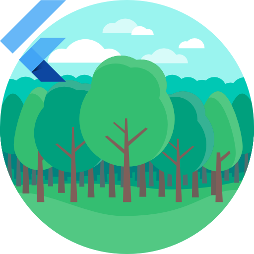
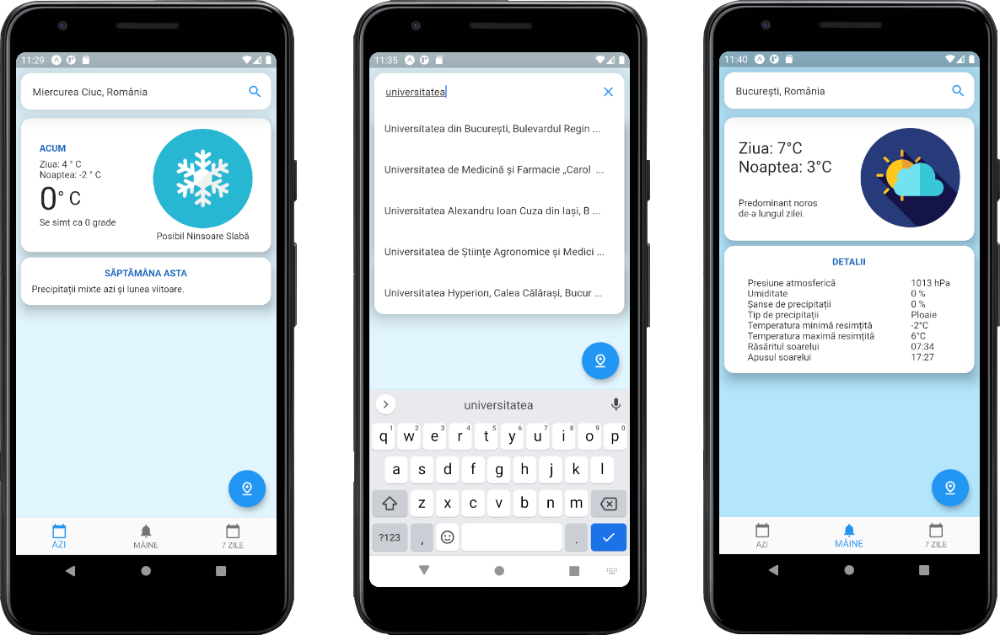

<!-- PROJECT LOGO -->
 

  

  <h3 align="center">Flutter Weather Info </h3>

<!-- TABLE OF CONTENTS -->

  
Table of Contents

  <ol>
    <li>
      <a href="#about-the-project">About The Project</a>
      <ul>
        <li><a href="#built-with">Built With</a></li>
        <li><a href="#concepts-used">Concepts used</a></li>
      </ul>
    </li>
    <li><a href="#license">License</a></li>
    <li><a href="#contact">Contact</a></li>
  </ol>

<!-- ABOUT THE PROJECT -->
## About The Project

Weather app for Android/iOS/Web built with Flutter.
Project goal: refactoring my old weather app (Android - Java) into 2 new apps built with React Native and Flutter. 

See the React Native version here: https://github.com/stcojo/WeatherInfoReactNative

The app can use the device location for retrieving weather information or can use the built-in Google Places search widget to select another location.

### Built With

* [Flutter](https://flutter.dev/)
* [Dart language](https://dart.dev/)

<!-- GETTING STARTED -->
## Concepts used

* Flutter Navigation: https://flutter.dev/docs/development/ui/navigation
* Firebase for authentication: https://firebase.google.com/docs/auth
* Location package: https://pub.dev/packages/location
* Intl package: https://pub.dev/packages/intl
* Google Places API for fetching location information: https://developers.google.com/places/web-service/overview
* Google Reverse Geocoding API for transforming user position into a "Place": https://developers.google.com/maps/documentation/javascript/examples/geocoding-reverse
* DarkSky weather API for fetching weather data: https://darksky.net/dev

## What can be improved?
* Adding global state management (Provider approach or Redux)

<!-- CONTRIBUTING -->
## Contributing

Contributions are what make the open source community such an amazing place to be learn, inspire, and create. Any contributions you make are **greatly appreciated**.

1. Fork the Project
2. Create your Feature Branch (`git checkout -b feature/AmazingFeature`)
3. Commit your Changes (`git commit -m 'Add some AmazingFeature'`)
4. Push to the Branch (`git push origin feature/AmazingFeature`)
5. Open a Pull Request

<!-- LICENSE -->
## License

Distributed under the MIT License. See `LICENSE` for more information.

<!-- CONTACT -->
## Contact

Stefan Cojocaru - stefan.cojocaru@microsoft.com

Project Link: [Weather Info Flutter](https://github.com/stcojo/WeatherInfoFlutter)

[![MIT License][license-shield]][license-url]
[![LinkedIn][linkedin-shield]][linkedin-url]

<!-- MARKDOWN LINKS & IMAGES -->
<!-- https://www.markdownguide.org/basic-syntax/#reference-style-links -->
[contributors-shield]: https://img.shields.io/github/contributors/othneildrew/Best-README-Template.svg?style=for-the-badge
[contributors-url]: https://github.com/othneildrew/Best-README-Template/graphs/contributors
[forks-shield]: https://img.shields.io/github/forks/othneildrew/Best-README-Template.svg?style=for-the-badge
[forks-url]: https://github.com/othneildrew/Best-README-Template/network/members
[stars-shield]: https://img.shields.io/github/stars/othneildrew/Best-README-Template.svg?style=for-the-badge
[stars-url]: https://github.com/othneildrew/Best-README-Template/stargazers
[issues-shield]: https://img.shields.io/github/issues/othneildrew/Best-README-Template.svg?style=for-the-badge
[issues-url]: https://github.com/othneildrew/Best-README-Template/issues
[license-shield]: https://img.shields.io/github/license/othneildrew/Best-README-Template.svg?style=for-the-badge
[license-url]: https://opensource.org/licenses/MIT
[linkedin-shield]: https://img.shields.io/badge/-LinkedIn-black.svg?style=for-the-badge&logo=linkedin&colorB=555
[linkedin-url]: https://linkedin.com/in/stefangeorgecojocaru
[product-screenshot]: app.png
